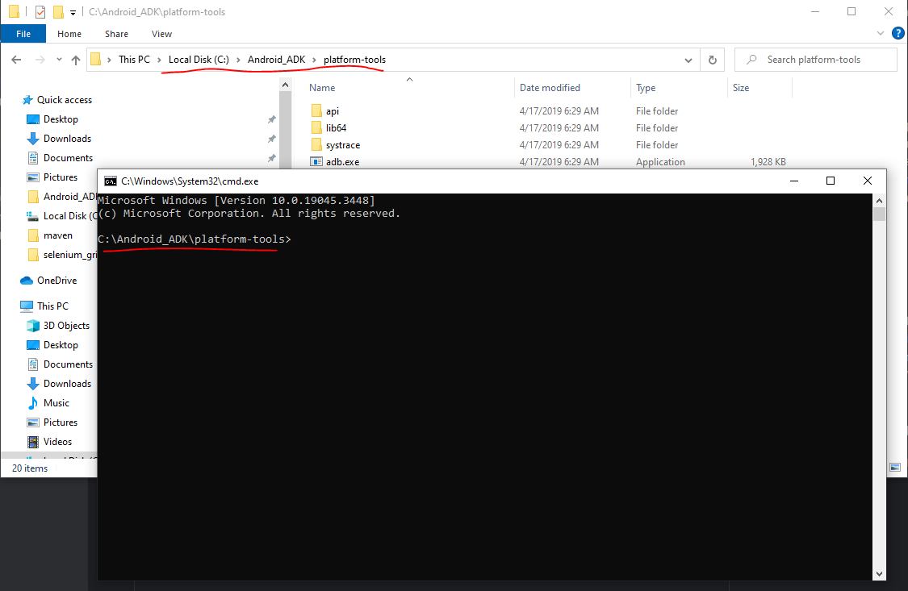

# Installation

1. Install Java (v11) and setup JAVA_HOME. 
2. Download Maven and setup MAVEN_HOME (https://maven.apache.org/download.cgi)
3. Download Android Studio and setup ANDROID_HOME(https://developer.android.com/studio)
4. Download platform-tools (https://developer.android.com/tools/releases/platform-tools)
5. Download & Install appium (https://github.com/appium/appium-desktop/releases/tag/v1.18.3)
6. 

# Devices Setup
1. Turn-on Development mode
    - Turn-on [USB debugging]
    - Turn-on [Disable permission monitoring]
2. Connect Device to Laptop/PC (File transfer/Android Auto)

## Check Device Connection
1. Open cmd in [platform-tools] 

2. Run [adb devices] to check if the device is connected or not.

3. Install the application [Rebound.apk]

# Run Automation
1. Git clone the source code
```agsl
git clone https://github.com/caohai0909/mobiledesign.git
```
2. Open source code by IntelliJ
3. Go to File > Project Structure > Make sure Java have already setup

4. Go to [Maven] > Disable [test] and select  clean & install > Click on [Run] icon

5. Expand code to [Regression.xml] file and change the udid of your device

6. Right click on [Regression.xml] and click on Run
